# **Excel Add-In**

Excel 是一款功能强大的电子表格软件，它支持数据的录入、存储、计算与分析。用户可以利用其内置的丰富函数进行数据处理，并通过图表直观展示数据趋势。此外，Excel 还具备数据排序、筛选、透视表等高级功能，可以帮助用户高效分析数据。

然而在应对庞大数据量及深度数据挖掘时，Excel的管理能力与诸多性能却稍显不足。针对此类情况，DolphinDB 以专属 Excel Add-In 为桥梁，为用户提供了“Excel + DolphinDB”的强大集成方案。凭借该方案，用户能够在熟悉的 Excel 环境中，便捷地运用 DolphinDB 的强大计算与分析能力，结合 Excel 本身的诸多功能，更灵活、更高效地实现数据的复杂处理、深度分析与直观可视化，从而应对复杂多变的海量数据挑战。

下图展示了 DolphinDB Excel Add-In 的使用界面。从左到右的图标分别表示连接配置、连接节点选择、SQL 查询面板、插件功能配置。

图 DolphinDB Excel Add-In 的使用界面

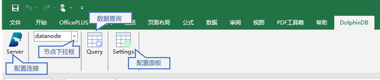

## 1. 安装说明

用户可以在微软 Excel 的 Add-In 加载项中添加该插件。具体安装步骤如下：

（1）根据当前使用的 Excel 版本，在本地下载文件 DolphinDBExcel-AddIn-packed.xll(Windows 32位) 或者 DolphinDBExcel-AddIn64-packed.xll(Window 64位) 。

图 1-1 下载包示例

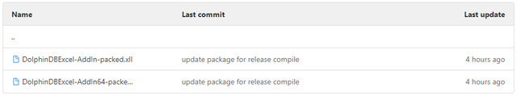

注意：Excel 的 32/64 位版本信息可以在 Excel 的“文件”->“账户”->“关于Excel”里找到。

图 1-2 Excel 的版本信息界面

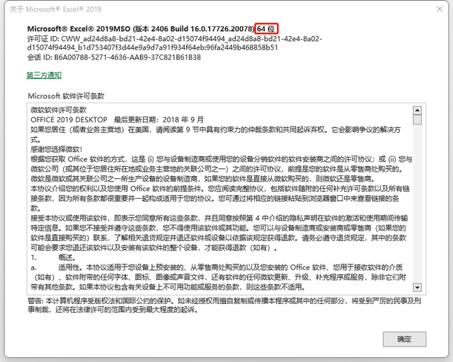

（2）在 Excel 中依次单击“文件”->”选项“->”加载项”。

图 1-3 加载项界面

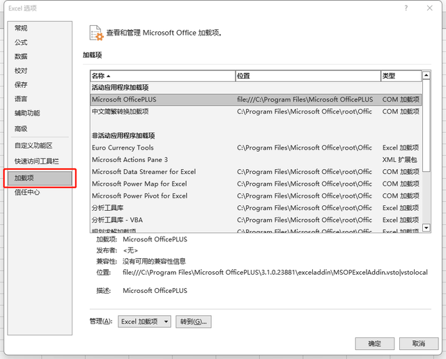

（3）在”管理”栏中选择“Excel 加载项”，然后单击“转到”。

图 1-4 选中“Excel 加载项”，单击“转到”

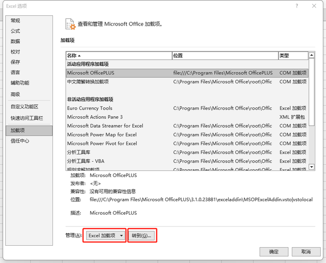

（4）单击”浏览”。在安装路径中找到 *DolphinDBExcel-AddIn64-packed.xll* 文件（32 位的 Office 需要选择*DolphinDBExcel-AddIn-packed.xll* 文件）。

图 1-5 单击“浏览”

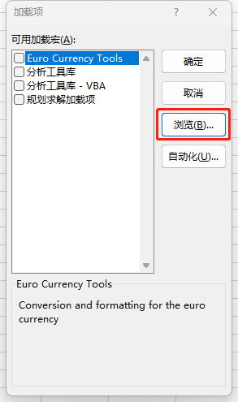

图 1-6 导入“DolphinDBExcel Add-In”

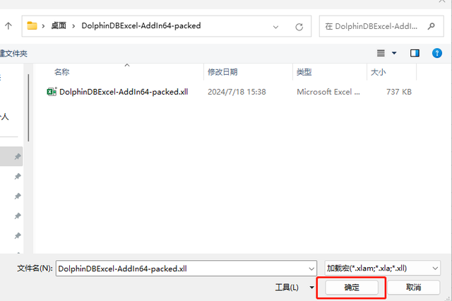

（5）系统自动返回加载项界面，选中刚刚导入的“DolphinDBExcel Add-In”。

图 1-7 选中“DolphinDBExcel Add-In”

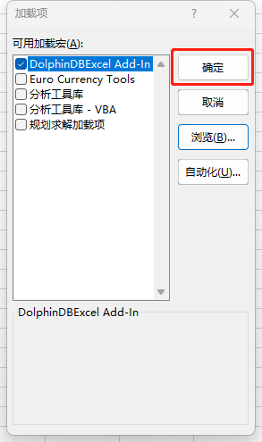

（6）成功安装后，会在 Excel 的主菜单栏看到 “DolphinDB” 菜单栏。

图 1-8 成功安装

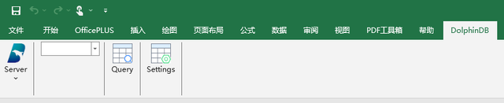

（7）更新插件时，在 Excel 中依次单击“文件”->”选项“->”加载项”->”转到”，取消勾选原加载项，点击确定，并关闭选项框。

图1-9 取消勾选“DolphinDBExcel Add-In”

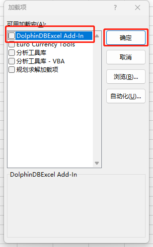

再次打开该选项框，按安装步骤，选择新的加载项。

## 2. 配置说明

本节讲解如何配置 DolphinDB server 连接和其他事项。

### 2.1 配置连接

单击“Server”，可以添加新的连接节点、或者修改已配置节点的连接信息。

图 2-1 单击“Server”

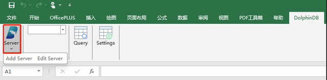

#### 2.1.1 添加新节点

单击“Add Server”以添加新节点。

图 2-2 单击“Add Server”

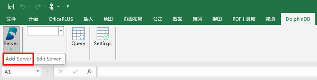

在页面中需要输入 Name（标识名）、Host（节点信息）、Port（端口信息）、User Name（用户名）和 Password（密码）。

图 2-3 添加界面

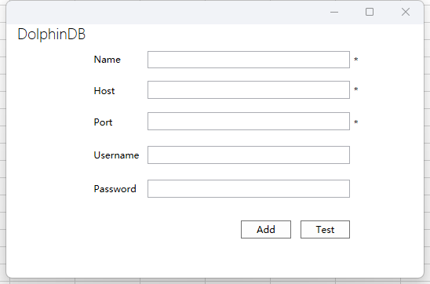

**参数说明：**

- **Name** 字符串，表示标识名，必填参数。
- **Host** 字符串，表示节点信息，必填参数。
- **Port** 整型，表示端口信息，必填参数。
- **User Name** 字符串，表示账号用户名。
- **Password** 字符串，表示账号密码。

图 2-4 添加新节点

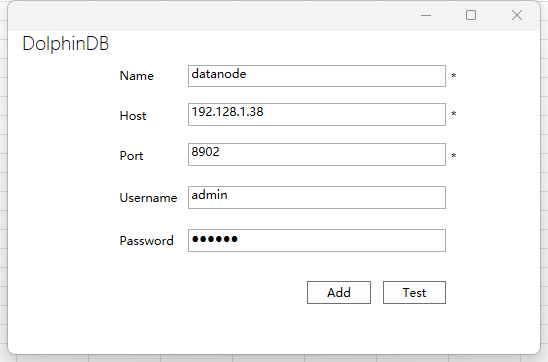

确认上述信息无误后，点击“Add”确认添加。此外，也可先点击“Test”以测试是否与目标节点连接成功。

完成添加后，新节点会自动出现在切换节点的下拉菜单中。

图 2-5 新节点添加成功

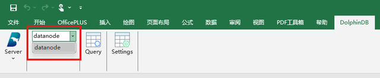

#### 2.1.2 修改节点信息

单击“Edit Server”以修改已配置的节点信息。

图 2-6 单击“Edit Server”

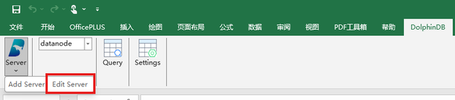

图 2-7 修改界面

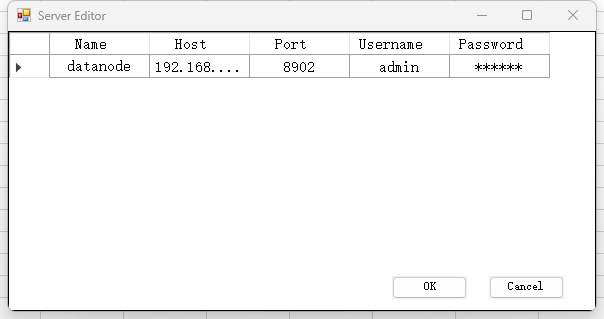

单击想要修改的信息，进行对应修改。修改后单击右下角的“OK”以保存。若要取消修改，则单击右下角的“Cancle”。

图 2-8 修改节点信息

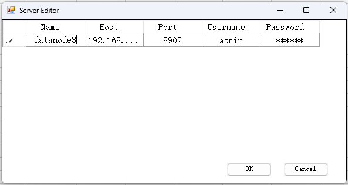

单击想要删除节点所在行的第一列，可以看到该行被选中，单击“Delete”键，将会看到该行节点信息被删除。点击“OK”已保存修改。

图 2-9 单击“Settings”

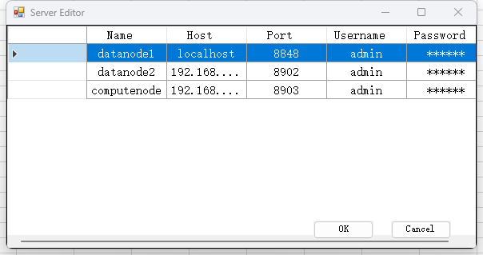

### 2.2 配置面板

单击“Settings”以打开配置面板。

图2-10 单击“Settings”

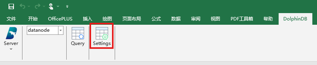

在该面板中，可以设置 SQL 查询面板的字体类型、字体大小，以及导出数据的最大行数限制。

同时可以看到，该面板中会显示当前 DolphinDB Excel Add-In 的版本信息。图 2-11 中显示信息为“Version: V1.0.0 2024.07.19”。

图 2-11 配置面板

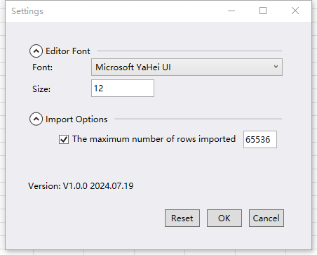

**配置项说明：**

Editor Font：

- **Font** 表示 SQL 面板中的字体类型。选择下拉框中的类型。
- **Size** 正整数，表示 SQL 面板中的字体大小。

Import Options:

- **The maximum number of rows imported** 如果勾选了该功能，则会限定每次导入 Excel 数据的行数。并且可在末尾的框中输入具体的行数上限。

确认修改后，点击“OK”以确认。

若要取消修改，可点击“Cancel”。

若要恢复默认配置，请点击“Reset”。

## 3. 使用说明

用户可在 Excel 中进行切换节点、数据查询、数据订阅和调用 DolphinDB 函数等操作。

### 3.1 切换节点

单击节点下拉框以切换节点。

图 3-1 切换节点

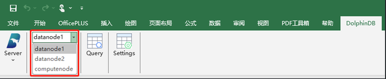

### 3.2 数据查询

有 2 种将数据导入到 Excel 表格的方法。操作如下，先单击“Query”，进入查询面板。

图 3-2 单击“Query”

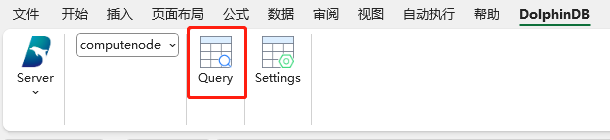

查询面板主要由菜单栏、项目导航栏、脚本编辑器和日志浏览器组成。其中菜单栏以图标的形式展示，鼠标放置时会弹出文本解释，从左到右依次为“Refresh”“Expand/Collapse”“Excute”“Excute & Import”。

图 3-3 查询面板

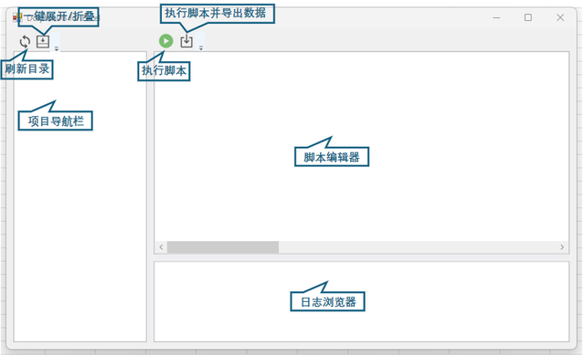

#### 方法一：直接导入

如果需要把某一个表的数据直接导入到 Excel 中，可进行如下操作。

（1）在 Excel 表格中选定需要导入数据的位置。

图 3-4 选中导入位置


（2）在变量列中右键单击对应的变量。

图 3-5 选中导入变量

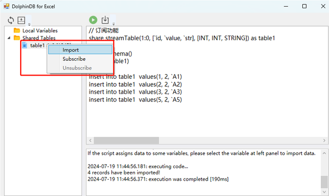

（3）选择“Import”。

图 3-6 单击“Import”

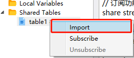

（4）成功导入数据。

图 3-7 导入成功

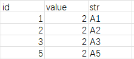

#### 方法二：使用 SQL 语句导入

支持将一个查询语句的返回值直接导入到 Excel 表格中。操作示例如下：

（1）在 Excel 表格中选定需要导入数据的位置。

（2）编写需要运行的脚本。

图 3-8 编写 SQL 脚本

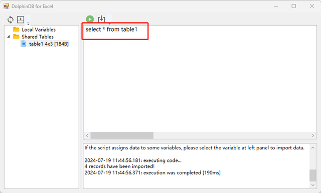

（3）点击“Execute & Import”。

图 3-9 单击“Execute & Import”及其响应日志

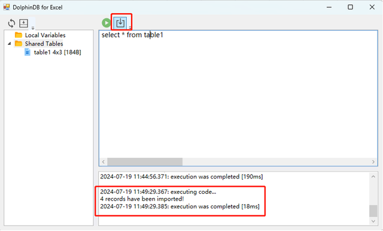

（4）成功导入数据。

图 3-10 导入成功

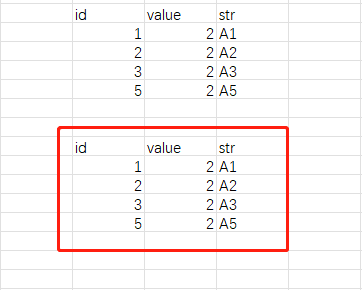

### 3.3 数据订阅

支持订阅 DolphinDB 中流表的数据。操作示例如下：

（1）在 Excel 表格中选定需要导入数据的位置。

图 3-11 选定需要导入数据的位置


（2）在变量列中右键单击对应的变量。

（3）选择“Subscribe”。

图 3-12 选择“Subscribe”

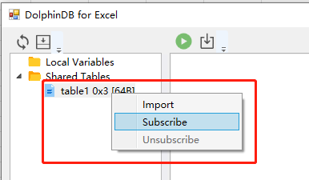

（4）指定刷新主键。每当有新的数据进来时，主键相同的数据则会刷新，主键不存在时则会添加一行数据。此处输入“id”。

图 3-13 指定刷新主键

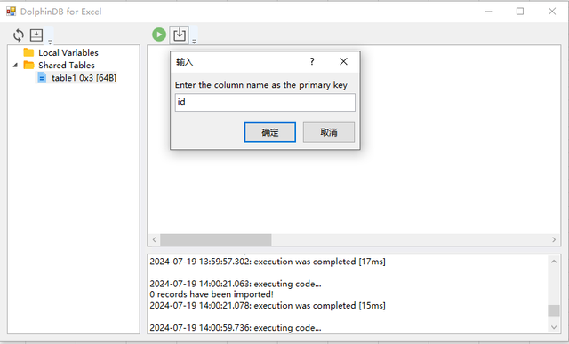

（5）如果所连 server 的版本小于或等于 200.8，则需要填入客户端的流订阅端口。

图 3-14 输入端口（仅限 2.00.8 及以前版本）

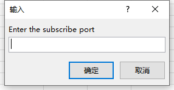

（6）订阅成功后会显示表结构。

图 3-15 成功订阅

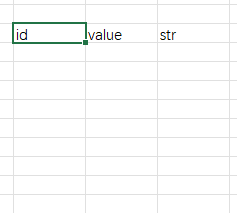

（7）当订阅的流表有新增数据时，会在表格里刷新数据。

图 3-16 刷新数据

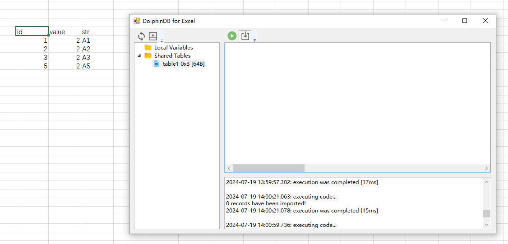

（8）点击“Unsubscribe”以关闭数据订阅。

图 3-17 取消订阅

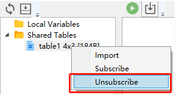

### 3.4 函数调用 

支持在 Excel 中调用 DolphinDB 的函数。主要通过 `RUNFUNCTION(values1, values2,...)` 实现。该函数能够在 Excel 表格中远程执行 DolphinDB 上的函数或函数视图，并且可以填入参数，执行结果会返回到 Excel 指定的表格中。

**参数介绍：**

在 Excel 中，`RUNFUNCTION` 的参数为 *values1, values2,……* 其中，

- **values1** 必填参数，表示 functionName，即 DolphinDB server 中的函数。函数可参考 [DolphinDB 函数文档说明](https://docs.dolphindb.cn/zh/2.00.13/funcs/funcs_intro.html)。
- **values2,……** 表示被调用函数对应的参数。其数量没有限制，可以是 0。

注意：Excel 中 INT 的数据底层使用 DOUBLE 类型数据来存储。故填入 INT 类型的参数会转换成 DOUBLE 类型的数据，如 `=RUNFUNCTION("funcTest", 2)`，这时会在 DolphinDB 中执行 `funcTest(2.0$DOUBLE)`。

**使用示例：**

在 DolphinDB 数据库中有 `getTableData` 这一函数视图。

```
def getTableData(dataType){
	if(dataType == "type1"){
		return table(1..10 as id, 1..10 as value)
	}else{
		return table(1..10 as id, 11..20 as value)
	}
}

addFunctionView(getTableData)
```

在 Excel 中选择一块表格区域，然后调用函数 `=RUNFUNCTION("getTableData", "type1")`，最后按下回车键以执行函数。如下为示例截图。

图 3-18 函数调用示例

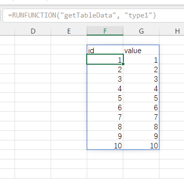
