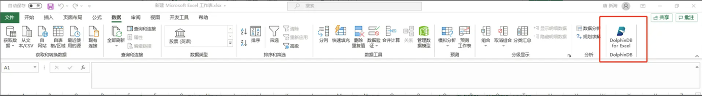
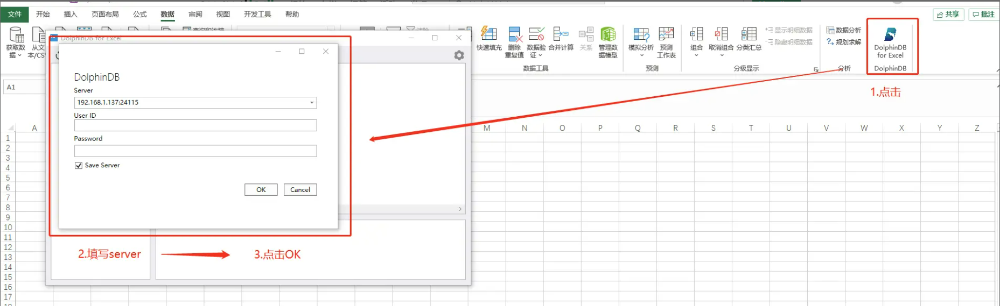
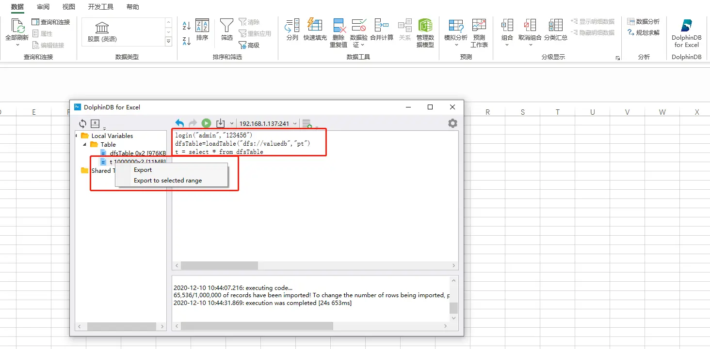
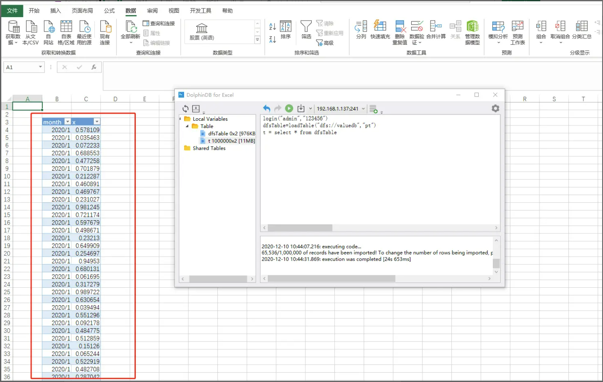
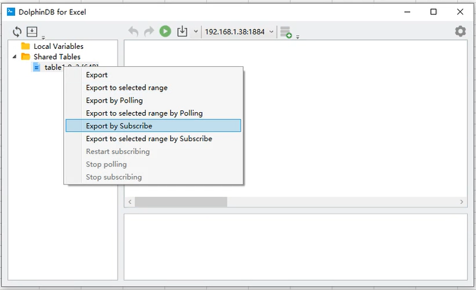
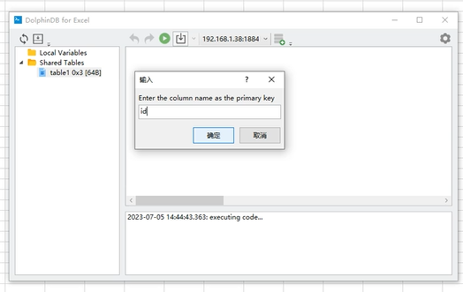
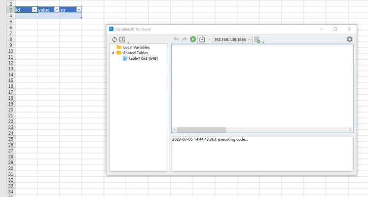
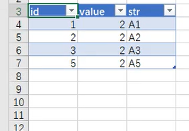
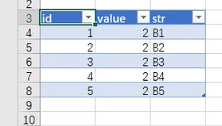
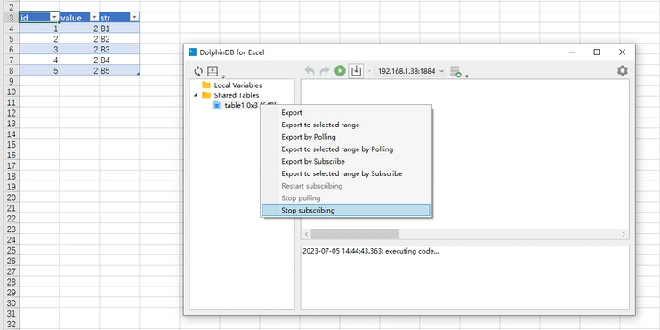

# DolphinDB Excel 插件使用说明

现提供可直接连接 DolphinDB 数据库的 Excel 插件。用户可以在微软 Excel 的 add-in 加载项中添加该插件。

## 1 安装插件

安装步骤如下：

1、[下载插件 SetupDolphinDBForExcelRelease.msi](https://gitee.com/dolphindb/excel-add-in)。

2、指定安装目录，安装 SetupDolphinDBForExcelRelease.msi。

版本说明：

支持 2016 及以上版本的 Excel。

## 2 插件使用

新建一个 Excel 文件，第一次打开时将提示“加载 DolphinDB for Excel”。

可在工具栏的最右侧看到图标显示“DolphinDB for Excel”。示例如下：

点击“DolphinDB for Excel”。然后在弹出的登陆框中填入要连接的 Server 地址，并填写 User ID 和 Password，然后点击“OK”。示例如下：

### 2.1 数据查询

如需把某一个表的数据直接导入 Excel 中。首先查询加载该表，然后在目录“Local Variables”中鼠标右键单击该表，选择导出的位置即可。示例如下：

成功导出表数据：

### 2.2 数据订阅

如需订阅流表的数据，则在目录“Shareed Tables”中鼠标右键单击该表，然后选择“Export by Subscribe”。示例如下：

然后指定刷新主键。每当有新的数据进来时，主键相同的数据则会刷新，主键不存在时则会添加一行数据。示例如下：

订阅成功后将显示表结构。示例如下：

当订阅的流表有新增数据时，则表格里将刷新数据。示例如下：

若要关闭数据订阅，则在目录“Shareed Tables”中鼠标右键单击该表，然后选择“Stop subscribing”。示例如下：

## 3 支持的 DolphinDB 数据类型

| 分类     | 名称          | 举例                                                           | 范围                                                           |
|----------|---------------|----------------------------------------------------------------|----------------------------------------------------------------|
| LOGICAL  | BOOL          | 1b, 0b, true, false                                            | 0~1                                                            |
| INTEGRAL | CHAR          | ‘a’, 97c                                                       | -2 7 +1~2 7 -1                                                 |
|          | SHORT         | 122h                                                           | -2 15 +1~2 15 -1                                               |
|          | INT           | 21                                                             | -2 31 +1~2 31 -1                                               |
|          | LONG          | 22l                                                            | -2 63 +1~2 63 -1                                               |
| TEMPORAL | DATE          | 2013.06.13                                                     |                                                                |
|          | MONTH         | 2012.06M                                                       |                                                                |
|          | TIME          | 13:30:10.008                                                   |                                                                |
|          | MINUTE        | 13:30m                                                         |                                                                |
|          | SECOND        | 13:30:10                                                       |                                                                |
|          | DATETIME      | 2012.06.13 13:30:10 or 2012.06.13T13:30:10                     | [1901.12.13T20:45:53, 2038.01.19T03:14:07]                     |
|          | TIMESTAMP     | 2012.06.13 13:30:10.008 or 2012.06.13T13:30:10.008             |                                                                |
|          | NANOTIME      | 13:30:10.008007006                                             |                                                                |
|          | NANOTIMESTAMP | 2012.06.13 13:30:10.008007006 or 2012.06.13T13:30:10.008007006 | [1677.09.21T00:12:43.145224193, 2262.04.11T23:47:16.854775807] |
|          | DATEHOUR      | 2012.06.13T13                                                  |                                                                |
| FLOATING | FLOAT         | 2.1f                                                           | 有效位数: 06~09 位                                             |
|          | DOUBLE        | 2.1                                                            | 有效位数: 15~17 位                                             |
| LITERAL  | SYMBOL        |                                                                |                                                                |
|          | STRING        | “Hello” or ‘Hello’ or `Hello                                   |                                                                |
|          | BLOB          |                                                                |                                                                |
| BINARY   | INT128        | e1671797c52e15f763380b45e841ec32                               | -2 127 +1~2 127 -1                                             |
|          | UUID          | 5d212a78-cc48-e3b1-4235-b4d91473ee87                           |                                                                |
|          | IPADDR        | 192.168.1.13                                                   |                                                                |

**注意**：

- 支持上述所有数据类型对应的 array vector 类型。
- 该插件现支持的最小时间精度为毫秒。目前仅可使用数据类型为 TIME, TIMESTAMP, NANOTIME, NANOTIMESTAMP 的毫秒精度的数据。

关于 DolphinDB 数据类型的更多说明可参考 [DolphinDB-数据类型](https://docs.dolphindb.cn/zh/progr/data_types.html)。
